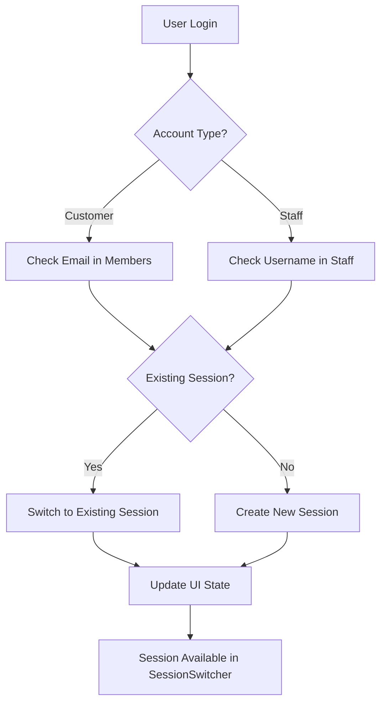

# Multi-Session Authentication System

## Problem Solved

The original bubble tea shop system had a critical flaw: **it could only handle one user logged in at a time per browser**. This caused permission conflicts when managers and customers tried to use the same browser simultaneously.

### Issues Fixed:
- ❌ **Session Conflicts**: When a manager and customer logged in on the same browser, their sessions would overwrite each other
- ❌ **Permission Errors**: Role validation failed due to conflicting user types in shared storage  
- ❌ **Poor UX**: Users had to constantly log out and log back in to switch between roles
- ❌ **Data Corruption**: Session data could become corrupted when different account types mixed

## Solution: Multi-Session Management

We implemented a comprehensive **multi-session system** that allows multiple users of different types to be logged in simultaneously on the same browser.

### Key Features:

#### 🔄 **Session Switching**
- **Seamless Role Switching**: Users can instantly switch between customer and staff accounts without logging out
- **Visual Session Indicator**: Clear UI shows all active sessions with role badges
- **One-Click Access**: Switch sessions with a single click

#### 👥 **Multiple Concurrent Sessions**  
- **Isolated Sessions**: Each user gets their own session storage with unique identifiers
- **No Cross-Contamination**: Customer and staff sessions remain completely separate
- **Preserved State**: Switching sessions maintains all user data and preferences

#### 🎨 **Enhanced Login Experience**
- **Login Mode Switcher**: Clear toggle between customer and staff login forms
- **Role-Specific Forms**: Different input fields for different user types (email vs username)
- **Smart Session Detection**: Automatically switches to existing session if user is already logged in

#### 🛡️ **Robust Session Management**
- **Session Persistence**: Sessions survive browser refreshes and page navigation  
- **Automatic Cleanup**: Invalid or expired sessions are automatically removed
- **Migration Support**: Seamlessly migrates old single-session data to new format

## Technical Implementation

### Core Components

#### 1. **SessionManager** (`utils/sessionManager.js`)
The brain of the multi-session system:

```javascript
// Create multiple isolated sessions
sessionManager.createSession(user, token)

// Switch between active sessions  
sessionManager.switchSession(sessionId)

// Get all sessions by type
sessionManager.getSessionsByType('staff') // or 'member'

// Smart duplicate detection
sessionManager.findExistingSession(accountType, identifier)
```

#### 2. **SessionSwitcher Component**
Interactive UI for managing multiple sessions:

- **Visual Session List**: Shows all active sessions with user names and roles
- **Role Badges**: Color-coded badges (Manager=Red, Staff=Blue, Customer=Green)
- **Quick Actions**: One-click session switching and individual logout
- **Bulk Operations**: "Logout All Sessions" for complete cleanup

#### 3. **LoginModeSwitcher Component**  
Enhanced login experience:

- **Mode Toggle**: Switch between Customer and Staff login forms
- **Context-Aware Forms**: Shows appropriate fields (email vs username)
- **Visual Indicators**: Clear icons and descriptions for each mode

### Database Schema Compatibility

The solution works with existing database structure:

```sql
-- Members table (customers)
members: id, email, password_hash, full_name, is_active

-- Staff table (staff/managers)  
staff: id, username, password_hash, full_name, role, is_active
```

No database changes required!

### Authentication Flow



## Usage Examples

### For Managers/Staff:
1. **Login as Staff**: Use the staff login form with username/password
2. **Switch to Customer View**: Use SessionSwitcher to add a customer session  
3. **Test Customer Features**: Experience the app from customer perspective
4. **Quick Role Switching**: Toggle between sessions without re-authentication

### For Shared Devices:
1. **Multiple Users**: Different people can login simultaneously  
2. **Preserved Sessions**: Each user's session remains active
3. **Easy Switching**: Quick access to any active session
4. **Clean Logout**: Remove individual sessions or all at once

### For Development/Testing:
1. **Multi-Role Testing**: Test different user roles simultaneously
2. **Session Management**: Verify session isolation and data integrity
3. **Permission Testing**: Ensure proper authorization for each role

## Security Features

### 🔐 **Session Isolation** 
- Each session has unique identifiers and storage keys
- No data leakage between different user sessions
- Proper JWT token management per session

### 🛡️ **Permission Validation**
- Backend validates tokens independently for each request
- Role-based access control remains intact
- No session confusion at API level

### 🔄 **Session Lifecycle**
- Automatic cleanup of invalid sessions
- Proper session expiration handling  
- Secure token storage and rotation

## Migration & Backward Compatibility

### Automatic Migration
- Detects old single-session localStorage data
- Automatically converts to new multi-session format
- Cleans up legacy storage keys

### Zero Disruption
- Existing users experience seamless upgrade
- No re-authentication required
- All existing functionality preserved

## Benefits

### ✅ **For Users**
- **Convenience**: No more constant logging in/out
- **Flexibility**: Switch roles instantly as needed
- **Clarity**: Always know which account is active

### ✅ **For Managers**  
- **Efficiency**: Test customer features without losing admin access
- **Training**: Easy demonstration of different user experiences
- **Support**: Help customers while maintaining admin access

### ✅ **For Developers**
- **Testing**: Simultaneous multi-role testing
- **Debugging**: Easy reproduction of permission issues
- **Maintenance**: Clear session management and debugging

### ✅ **For Business**
- **Productivity**: Staff can efficiently handle multiple tasks
- **Training**: Better onboarding with role switching
- **Support**: Improved customer service capabilities

## Future Enhancements

### Planned Features:
- **Session Timeouts**: Configurable session expiration
- **Session Naming**: Custom names for sessions  
- **Session History**: Track login/logout activities
- **Admin Panel**: Centralized session management for managers
- **Session Sharing**: Temporary session sharing for training

### Performance Optimizations:
- **Lazy Loading**: Load session data only when needed
- **Memory Management**: Optimized storage for large session counts
- **Background Sync**: Automatic session state synchronization

---

## Getting Started

The multi-session system is now active! Simply:

1. **Navigate to `/order`** - Use the new login interface
2. **Toggle Login Mode** - Switch between Customer and Staff login
3. **Login Multiple Accounts** - Add as many sessions as needed
4. **Use Session Switcher** - Access it from any page when multiple sessions exist
5. **Switch Seamlessly** - Toggle between roles with one click

**No configuration required** - the system automatically manages everything!